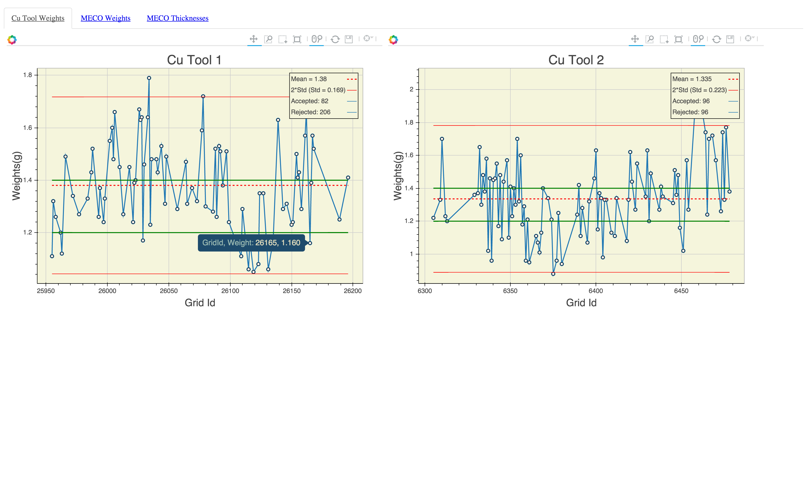

# WebApp built during GTAT Summer Internship  

Given Excel file of data points, script uses the Bokeh Graphing library to produce SPC graphs.  

Python: 
  -openpyxl to handle the Excel Data 
  -pandas to clean and store  
  -numpy to analyze 
  -Bokeh to plot  
  
Javascript: 
  -callback function to react to user interaction
